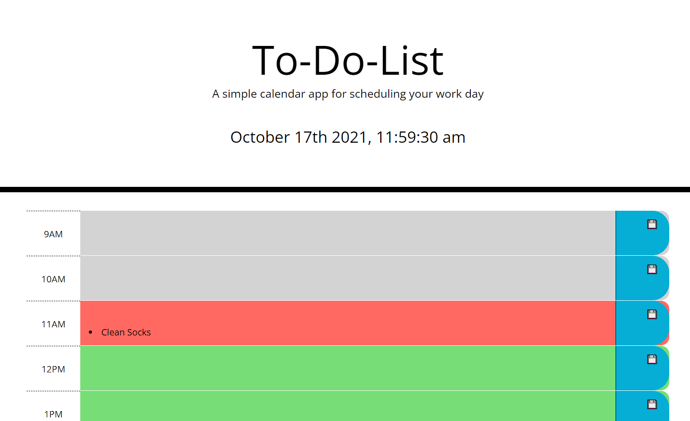

# Work Day To-Do List

## About This Project

This project was an introductory excercise to working with Third-Party APIs such as Bootstrap, jQueryUI, and Moment.js. Each Third-Party API was utilized to code the logic and style the page. 

## How To Use

The Work Day To-Do List is a color-coded, real-time organized to-do list. The user can input tasks into each timeslot by clicking on the boxes in the middle and save the task by clicking the save button on the right side. The timeslots are color-coded depending on the time of day: gray boxes are in the past, the red box is the present hour, and green boxes are in the future. The timeframe resets at midnight. Items inputted into the boxes are stored locally and persist when the user refreshes the page.

## Access

You can access the Work Day To-Do List at https://tjtahmas.github.io/Calendar-To-Do-List/

## License

This project was created as part of The Ohio State Coding Boot Camp